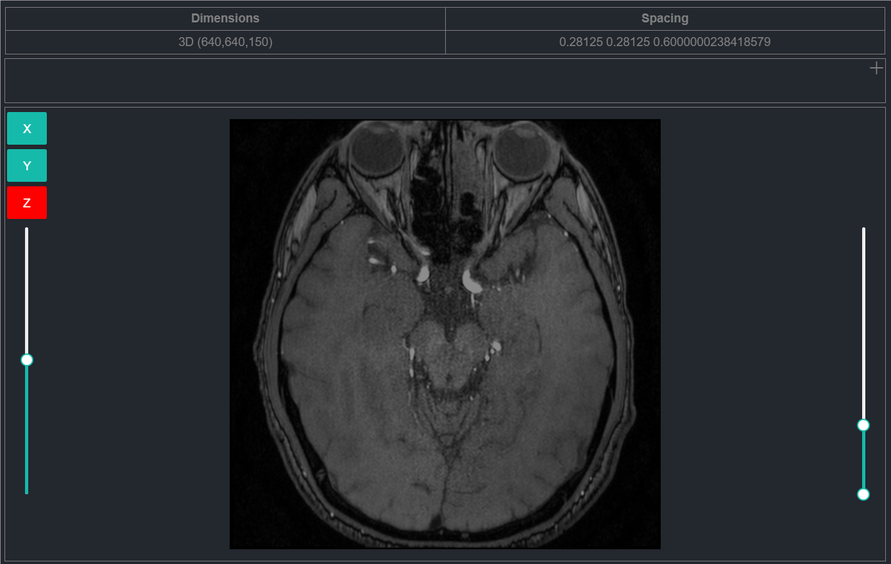
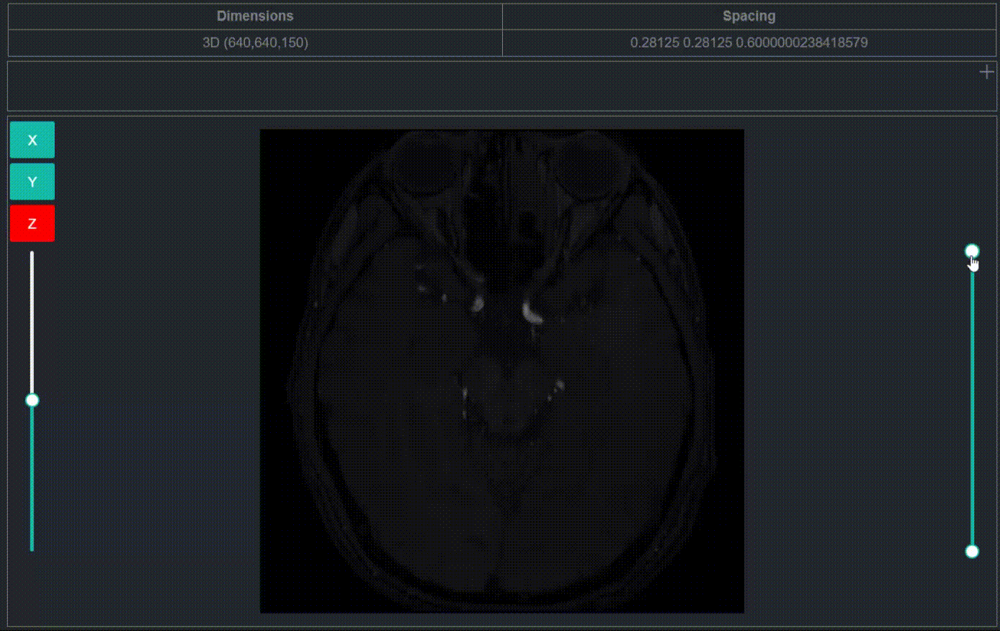
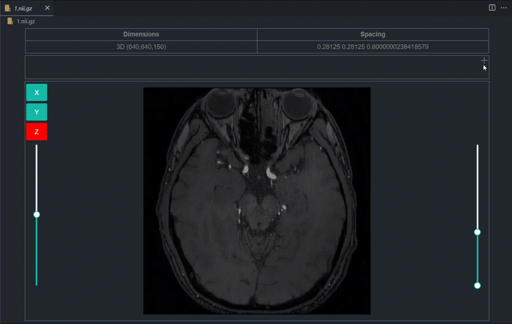

## [Medical Viewer](https://marketplace.visualstudio.com/items?itemName=dklsgui.medical-viewer)

## [GitHub Repo](https://github.com/dklsgui/MedicalViewer) 

If you need to work with data in the medical image field, then this extension can help you, which allows users to visualize the volume data in medical image files and run on it to add label data. 

Currently supported data formats: `nii`, `nii.gz`

  

## Features

###  Windowing、Switch slice、Switch axis
- Windowing: Adjust the window width and window level of the image
- Switch slice: Switch the slice of the image
- Switch axis: Switch the axis of the image

### Add label
- Add label: Add label data to the image
- Delete label: Delete label data from the image
- Select label color: Select the color of the label

## CHANGELOG

[CHANGELOG.MD](https://github.com/dklsgui/MedicalViewer/blob/master/CHANGELOG.md)

## Contributors

